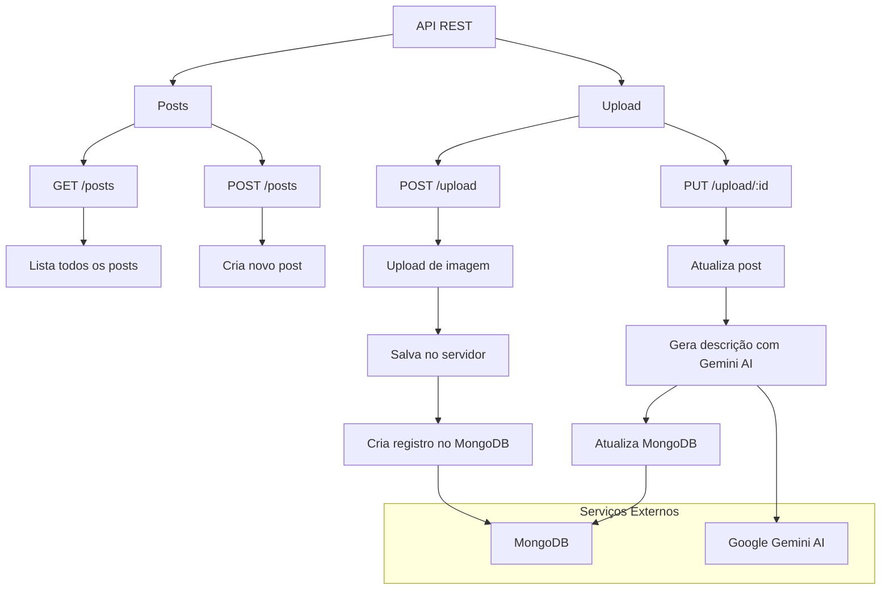

# Imersão Back-End da Alura

## Resumo do Projeto

Este projeto é uma API de backend desenvolvida durante a Imersão Back-End da Alura. Ele utiliza Node.js e Express para criar e gerenciar posts em um banco de dados MongoDB. A API permite listar, criar, atualizar posts e fazer upload de imagens. Além disso, integra a API do Gemini AI para gerar descrições automáticas para os posts. O projeto inclui configuração de variáveis de ambiente, dependências necessárias e instruções para iniciar o servidor localmente.


#### Pré-requisitos

- Node.js v18 ou superior - [Download Node.js](https://nodejs.org/)
- MongoDB instalado localmente ou uma conta MongoDB Atlas
- Conta Google AI Studio para a API do Gemini AI 
- Postman (opcional, para testar a API)

#### Configuração

1. Clone o repositório
```bash
git clone <url-do-repositorio>
cd <nome-do-projeto>
```

2. Instale as dependências
```bash
npm install
```

3. Configure as variáveis de ambiente
- Crie um arquivo `.env` na raiz do projeto
```env
MONGODB_URI=sua_url_mongodb
GEMINI_API_KEY=sua_chave_api_gemini
PORT=3000
```

4. Obtendo as chaves necessárias:
- **MongoDB URI**: 
  - Crie uma conta em [MongoDB Atlas](https://www.mongodb.com/cloud/atlas)
  - Como configurar o MongoDB[Usando mongoDB com Node [mongodb]](https://www.youtube.com/watch?v=4nO0BERnkc0)
    
- **Gemini API Key**:
  - Acesse [Google AI Studio](https://aistudio.google.com/app/apikey?utm_source=website&utm_medium=referral&utm_campaign=Alura-dev-backend-immersion&utm_content=)
  - Crie ou selecione uma chave API do Gemini

5. Inicie o servidor
```bash
npm run dev
```

### 🛠️ Passo a Passo para Iniciar o Projeto

1. Instale o Node.js:
   - Acesse [https://nodejs.org/](https://nodejs.org/)
   - Baixe e instale a versão 18.x LTS ou superior

2. Verifique a instalação do Node.js e npm:
   ```bash
   node --version
   npm --version
   ```

3. Clone o repositório e instale as dependências:
   ```bash
   git clone <url-do-repositorio>
   cd <nome-do-projeto>
   npm install
   ```

4. Configure as variáveis de ambiente:
   - Crie um arquivo `.env` na raiz do projeto
   - Adicione as seguintes variáveis:
     ```
     MONGODB_URI=sua_url_mongodb    # URL de conexão com o banco de dados MongoDB
     GEMINI_API_KEY=sua_chave_api_gemini    # Chave de API do Google Gemini para geração de texto
     PORT=3000    # Porta onde o servidor será iniciado
     ```

5. Obtenha a chave da API Gemini:
   - Acesse [Google AI Studio](https://aistudio.google.com/app/apikey?utm_source=website&utm_medium=referral&utm_campaign=Alura-dev-backend-immersion&utm_content=)
   - Criar chave api (ou selecione um existente)
   - Copie a chave gerada e adicione ao arquivo `.env` em `GEMINI_API_KEY`

6. Inicie o servidor:
   ```bash
   npm run dev
   ```

7. Teste a API com Postman:
   - Instale o [Postman](https://www.postman.com/downloads/)
   - Crie uma nova coleção para o projeto
   - Configure as seguintes requisições:
     - GET http://localhost:3000/posts
     - POST http://localhost:3000/posts
     - POST http://localhost:3000/upload
     - PUT http://localhost:3000/upload/:id

   Exemplo de uso no Postman:
   - Para fazer upload de uma imagem (POST /upload):
     1. Selecione "Body" > "form-data"
     2. Adicione uma chave "image" do tipo "File"
     3. Selecione o arquivo de imagem
     4. Envie a requisição

   - Para atualizar um post com descrição gerada por IA (PUT /upload/:id):
     1. Substitua ":id" pelo ID do post
     2. Envie a requisição (a descrição será gerada automaticamente pelo Gemini AI)

### 🔄 Estrutura do Projeto 

### Considerações Finais

Autor: Anderson Gabriel da Silva Campos [@DutsTate0213](https://github.com/DutsTate0213)

### Referências
- [Node.js](https://nodejs.org/)
- [MongoDB](https://www.mongodb.com/)
- [Google Gemini AI](https://ai.google.com/gemini)
- [Usando mongoDB com Node [mongodb]](https://www.youtube.com/watch?v=4nO0BERnkc0)
- [Como criar uma API REST com Node.js e Express](https://www.youtube.com/watch?v=4nO0BERnkc0)
- [Alura](https://www.alura.com.br/)
